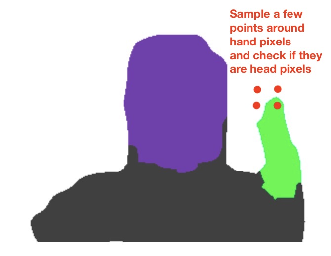

# dont-touch-men v3 (readme update)

Alert people before they are touching MEN (Mouth Eyes Nose).

### ITERATION 3 / WORK IN PROGRESS

Demo: https://i3games.github.io/dont-touch-men/

2021 update. From what is currently known, Covid 19 is transmitted via aerosols, see e.g. 

https://www.wired.com/story/the-teeny-tiny-scientific-screwup-that-helped-covid-kill/

Therefore previous public advice regarding infection prevention may be inaccurate. 

There may be useful applications to monitor / prevent involuntary self-face touching.
This project does NOT constitute medical advice. It is intended as a showcase for machine learning on mobile devices / in the browser. 

During the first weeks of the panemic, during videoconferences and on social media I noticed people constantly touching their faces. It seems to happen subconsciously. Even if you tell people not to do it they will have their hand in their face a minute later. Science has numbers: "On average, each of the 26 observed students touched their face 23 times per hour. Of all face touches, 44% (1,024/2,346) involved contact with a mucous membrane."

Kwok, Yen Lee Angela, Jan Gralton, and Mary-Louise McLaws. 2015. ‘Face Touching: A Frequent Habit That Has Implications for Hand Hygiene’. American Journal of Infection Control 43 (2): 112–14. https://doi.org/10.1016/j.ajic.2014.10.015.

I assume that this app could help to nudge people by warning them when their hands comes close to their faces.

### How to use

Do not **touch** your face in order to test this app.

**Don’t touch MEN** runs in modern web browsers (Firefox and Chrome). Based on my testing I recommend Chrome. 

1. You need a webcam showing your head and shoulders 
2. Download / clone this repo
3. Run index.html through a webserver, e.g. https://developer.mozilla.org/en-US/docs/Learn/Common_questions/set_up_a_local_testing_server  
4. To work with mobile devices at all, it must be served over an `https` connection.

How it works: **Don’t touch MEN** uses the Tensorflow bodypix model version 2. This is a trained machine learning model that takes an image, detects different body parts such as head and hands and returns an array with different values for each part. I take a sample around hand values and check if it is a head value. If so, the alarm is triggered.

### ITERATION 2 / WORK IN PROGRESS

With the first prototype I saw a number of problems: 

* False Positives especially when turning my face.
* False Negatives especially briefly after an alarm. 
* Delays through poor performance. 
* Does not work on iPad/Safari 

I rewrote the app with [TensorFlow.js](https://www.tensorflow.org/js) using [BodyPix version 2](https://github.com/tensorflow/tfjs-models/tree/master/body-pix) and [Tone.js](https://tonejs.github.io/). 

This has improved the reliability and performance significantly. I am still experimenting with various parameters. The app needs testing on different devices, in different conditions, with different people. 

Iteration 2 uses the following libraries / frameworks / tools

* tensorflowjs: https://www.tensorflow.org/js
* body-pix model version 2: https://github.com/tensorflow/tfjs-models/tree/master/body-pix
* Tone.js: https://tonejs.github.io/

Iteration 1 was built with the following libraries / frameworks / tools

* p5.js: https://github.com/processing/p5.js
* ml5.js: https://github.com/ml5js/ml5-library
* body-pix model version 1: https://www.npmjs.com/package/@tensorflow-models/body-pix/v/1.1.2

### Similar tools 

Some people have built or are building similiar tools. Here are the ones I am aware of.

* Lars Gleim: https://lgleim.github.io/handsOffMyFace/, code: https://github.com/lgleim/handsOffMyFace (also thanks for the scientific paper link)
* Mike Bodge, Brian Moore, and Isaac Blankensmith: https://donottouchyourface.com
* Holly Hook: https://play.google.com/store/apps/details?id=com.hollyhook.beepon, code: https://github.com/hollyhook/beepon (Android)
* MIT Media Lab (Team): https://www.media.mit.edu/projects/saving-face/overview/, https://github.com/camilorq/SavingFaceApp
