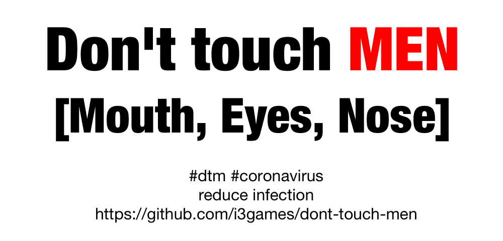

# dont-touch-men

Alert people before they are touching MEN (Mouth Eyes Nose).

### CURRENT STATUS: HACK / WORK IN PROGRESS

Demo: https://i3games.github.io/dont-touch-men/

In the current COVID-19 pandemic, a few rules have been communicated to reduce infections. 

1. Keep physical distance to other humans.
2. If you cough or sneeze, do it into your ellbow.
3. **Don’t touch MEN: Mouth Eyes Nose**.
4. Wash hands with soap.
5. Wash surfaces with soap water. 
6. Wear face masks if you have them and if supply is guaranteed for health and frontline workers. Yes, they help.
7. Protect elderly people and those wo are at risk.
8. Don't hoard.
9. Be excellent to each other.

Over the last couple of days, during videoconferences and on social media I have seen people constantly touching their faces. It happens subconsciously. Even if you tell people not to do it they will have their hand in their face a minute later. And so will you. This way the virus gets on a mucous membrane of yours and enters your body. 

Science has numbers: 
"On average, each of the 26 observed students touched their face 23 times per hour. Of all face touches, 44% (1,024/2,346) involved contact with a mucous membrane."

Kwok, Yen Lee Angela, Jan Gralton, and Mary-Louise McLaws. 2015. ‘Face Touching: A Frequent Habit That Has Implications for Hand Hygiene’. American Journal of Infection Control 43 (2): 112–14. https://doi.org/10.1016/j.ajic.2014.10.015.

This article gives some hint and describes challenges for behavioral change: 
https://foreignaffairs.co.nz/2020/03/20/how-to-stop-touching-your-face-to-minimize-spread-of-coronavirus-and-other-germs-133683/

I assume, this app, if improved, could help to nudge you into better behaviour by warning you when your hand comes close to your face.

To be clear. Do NOT do this: https://www.youtube.com/watch?v=IgR6uaVqWsQ

Also, do not **touch** your face in order to test this app.

### How to use
**dont-touch-men** runs in the browser. Any modern web browser should do. 

1. You need a webcam showing your head and shoulders 
2. Download / clone this repo
3. Run index.html through a webserver, e.g. https://developer.mozilla.org/en-US/docs/Learn/Common_questions/set_up_a_local_testing_server  

### WORK IN PROGRESS

I am seeing: 

* False Positives especially when turning my face.
* False Negatives especially briefly after an alarm. 
* Delays through poor performance. 

To do:

1. Improve the reliability and performance of the app. Also the crude detection has room for improvement
2. Make it run on mobile devices 
3. Test on different devices, in different conditions, with different people 
4. Build standalone apps
5. Reimplement in pure JS/Tensorflow with body-pix 2.0 https://github.com/tensorflow/tfjs-models/tree/master/body-pix

Uses the following libraries / frameworks / tools

* p5.js: https://github.com/processing/p5.js
* ml5.js: https://github.com/ml5js/ml5-library
* body-pix model: https://github.com/tensorflow/tfjs-models/tree/master/body-pix
* brfx: https://www.bfxr.net/

Similar tools 

* Lars Gleim: https://lgleim.github.io/handsOffMyFace/, code: https://github.com/lgleim/handsOffMyFace (also thanks for the scientific paper link)
* Mike Bodge, Brian Moore, and Isaac Blankensmith: https://donottouchyourface.com
* Holly Hook: https://play.google.com/store/apps/details?id=com.hollyhook.beepon, code: https://github.com/hollyhook/beepon (Android)
